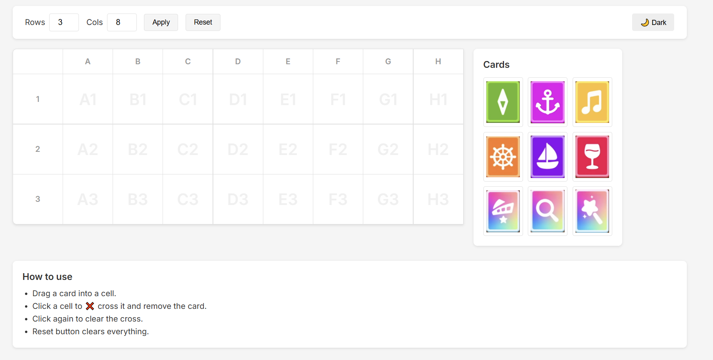

# KeyCardMatch Helper

A simple web-based tool to help tracking card matches in the KeyCardMatch game.

## Features
- **Dynamic Grid**: Create a grid of custom rows and columns (default 3x8).
- **Drag and Drop**: Drag card images from the sidebar into the grid cells.
- **Mark Matches**: Click a cell to mark it with an "X" (to indicate a match/removal).
- **Dark Mode**: Toggle between light and dark themes.
- **Responsive Design**: Works on desktop and mobile devices.

## How to Use
1. Open `index.html` in your web browser.
2. Set your desired **Rows** and **Cols** (e.g., 3 Rows, 8 Cols).
3. Click **Apply** to generate the grid.
4. Drag cards from the right sidebar into the corresponding grid cells.
5. Click a cell to cross it out when a match is made.
6. Click **Reset** to clear the board.

## Installation
No installation required. Just open `index.html` in any modern web browser.

## Project Structure
- `index.html`: Main application file.
- `style.css`: Styles and responsive layout.
- `script.js`: Application logic.
- `img/`: Folder containing card images.
